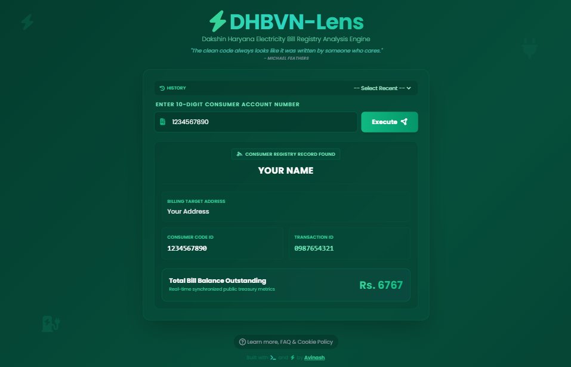

<!-- HEADER BANNER -->


<h1 align="center">⚡ DHBVN-Lens</h1>

<p align="center">
  <b>Advanced OSINT DHBVN Billing Registry & Account Lookup Engine</b>
</p>

<p align="center">
  <a href="https://dhbvn-bill-fetcher.vercel.app/"></a>
  <a href="https://www.python.org/"></a>
  <a href="https://fastapi.tiangolo.com/"></a>
  <a href="https://tailwindcss.com/"></a>
</p>

<p align="center">
  <a href="https://dhbvn-bill-fetcher.vercel.app/"><b>🌐 Live Demo</b></a> •
  <a href="#-features"><b>✨ Features</b></a> •
  <a href="#-api-endpoints"><b>📡 REST API</b></a> •
  <a href="#-local-development-setup"><b>🚀 Installation</b></a>
</p>

<p align="center">
  <a href="https://vercel.com/new/clone?repository-url=https%3A%2F%2Fgithub.com%2Facessrdpgg%2FDHBVN-Lens">
    
  </a>
</p>

---

## 🖼️ Application Preview

<p align="center">
  
</p>

---

## 🧐 What is DHBVN-Lens?

**DHBVN-Lens** is a lightweight, serverless OSINT tool engineered to extract and view open registration details from the Dakshin Haryana Bijli Vitran Nigam (DHBVN) portal. Designed for quick account lookups, it securely resolves customer names, locations, transaction keys, and active utility balances.

### Key Highlights
* **⚡ Full Data Extraction:** Pulls consumer identifier codes, name records, regional locations, and current balances simultaneously.
* **🛡️ Verification Bypass Engine:** Defeats superficial frontend CAPTCHA blocks via structural server payload automation and dummy tracking tokens.
* **💾 Persistent History Module:** Uses a localized, privacy-focused cookie system to recall recent searches for instant 1-click re-queries.
* **📱 Desktop & Mobile Responsive:** Built with a stunning dark-green emerald glassmorphism Tailwind CSS framework.

---

## 🛠️ Tech Stack & Architecture

| Layer | Technology | Purpose |
| :--- | :--- | :--- |
| **Frontend** | HTML5, Vanilla JS, Tailwind CSS | Micro-scaled glassmorphism UI |
| **Backend Framework** | FastAPI (Python 3.9+) | Asynchronous API orchestration |
| **Extraction Engine** | BeautifulSoup4 / Requests | ASP.NET State Session harvesting |
| **Deployment** | Vercel Serverless Functions | Zero-maintenance cloud hosting |

---

## 📡 API Endpoints

DHBVN-Lens operates as both a web application and a lightweight REST API.

### 1. Get Consumer Data by Account Number
```
GET /api/lookup?account_no=1234567890
```

**Example Response:**
```
{
  "success": true,
  "data": {
    "account_number": "1234567890",
    "consumer_name": "Your Name",
    "address": "Your Address",
    "amount_payable": "6767",
    "transaction_id": "1234567890",
    "registered_mobile": "1234567890",
  }
}
```

---

## ⚙️ How the Bypass Engine Works

The DHBVN backend architecture relies on two requests:
1. **GET Request:** Scrapes ASP.NET State Management tokens (`__VIEWSTATE`, `__VIEWSTATEGENERATOR`, `__EVENTVALIDATION`).
2. **POST Request:** Sends a simulated form payload. Since the CAPTCHA validation occurs entirely client-side via JavaScript, the server lacks an image cross-referencing validation step. DHBVN-Lens passes hardcoded fallback routing parameters (`txtcaptcha: "4321"`) to instantly unlock the response payload.

---

## 🚀 Local Development Setup

### Prerequisites
- Python 3.9 or higher
- Git

### 1. Clone & Navigate
```
git clone https://github.com/acessrdpgg/DHBVN-Lens.git
cd DHBVN-Lens
```

### 2. Setup Virtual Environment
```
# Windows
python -m venv venv
venv\Scripts\activate

# Linux / macOS
python3 -m venv venv
source venv/bin/activate
```

### 3. Install Dependencies & Run
```
pip install -r requirements.txt
uvicorn api.index:app --reload
```
Navigate to `http://127.0.0.1:8000` in your web browser.

---

## 📜 License

This project is open-source and available under the [MIT License](LICENSE).

<p align="center">
  Configured & Engineered with ❤️ by <a href="https://github.com/acessrdpgg"><b>acessrdpgg</b></a>
</p>